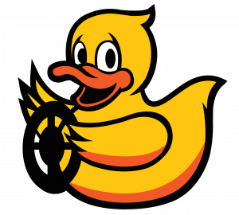

# UML Robotics Class Repo

This repository is for developing ROS-based 
software in Duckietown. Used for UML EECE 5560

	

## How to use it

Pull code to see my assignments work.

### Setup launchers

Setup launch files to remap topics and parameters 
that you wish to use in your own code.
